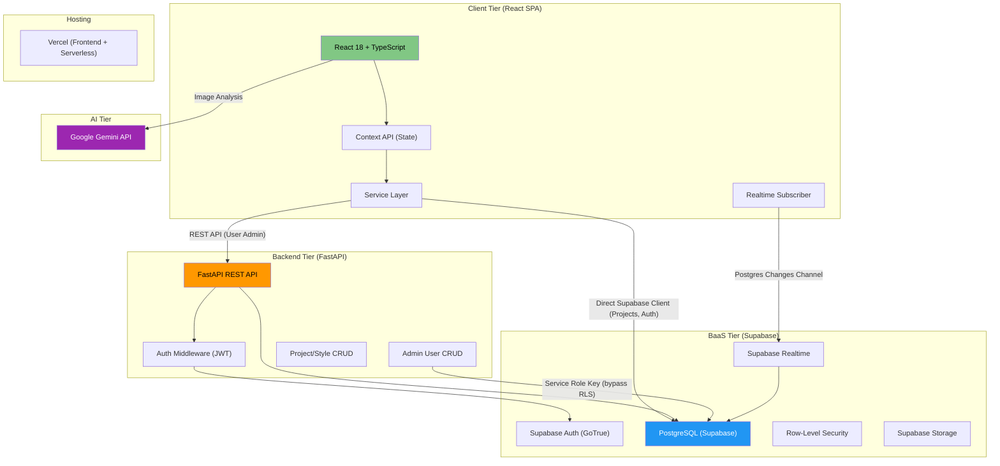
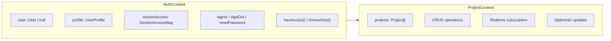
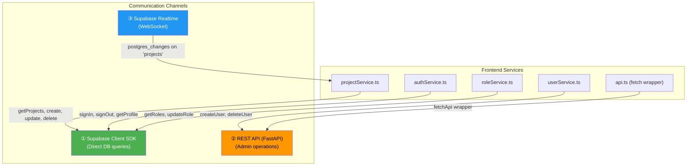
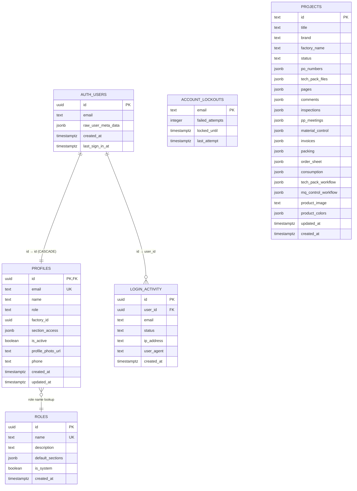

# FCBL System — Principal-Level Architectural Overview

> **System**: FCBL Production Management System (a.k.a. *GenPack Tech System*)
> **Domain**: Garment Manufacturing / Fashion Production Lifecycle Management
> **Analysis Date**: June 30, 2026

---

## 1. System Overview & Architecture

### 1.1 Core Purpose

The FCBL System is a **full-lifecycle garment production management platform** built for **Fashion Comfort (BD) Ltd** — a Bangladesh-based knitwear/garment manufacturer. It digitizes and centralizes the entire production pipeline from initial tech pack creation through QC inspection, commercial invoicing, and shipment packing.

**Key business capabilities:**

| Capability | Description |
|---|---|
| **Tech Pack Management** | Create, edit, and manage garment technical specifications including measurements, images, and fabric details |
| **Order Sheet Processing** | Manage purchase orders, buyer details, size breakdowns, and accessories per color/size matrix |
| **Consumption Tracking** | Track yarn/fabric consumption and accessory requirements per garment |
| **PP Meeting Management** | Record pre-production meetings with milestones, production details, and approvals |
| **Material Quality Control** | Track material receipt, quality, acceptance dates, and deadlines |
| **QC Inspection** | AQL-based quality inspection with defect tracking, measurement verification, and pass/fail judgement |
| **Commercial Documents** | Generate invoices with full export documentation (B/L, LC, consignee details) |
| **Packing Lists** | Box-level packing details with weight/volume calculations per shipment |
| **Approval Workflows** | Multi-stage document approval (Draft → Submitted → Approved/Rejected) across all sections |
| **AI-Powered Analysis** | Gemini AI integration for garment image analysis and auto-population of tech pack data |

### 1.2 Architectural Pattern

The system follows a **Hybrid Client-Heavy Architecture** with elements of both traditional client-server and BaaS (Backend-as-a-Service) patterns:



> [!IMPORTANT]
> **Dual Data Path Architecture**: The frontend communicates with PostgreSQL via **two parallel channels**:
> 1. **Direct Supabase Client** — Used for all project CRUD, auth, and profile operations (the primary path)
> 2. **FastAPI REST API** — Used exclusively for **admin user management** operations that require the `service_role` key to bypass RLS (creating users, deleting users, updating roles)
>
> This is a deliberate design choice: project data respects RLS policies using the user's JWT, while admin operations need elevated privileges that can only be safely executed server-side.

---

## 2. Frontend / Client Side

### 2.1 Core Framework & Libraries

| Technology | Version | Purpose |
|---|---|---|
| **React** | 18.2.x | UI rendering library |
| **TypeScript** | 5.3.x | Type safety |
| **Vite** | 5.0.x | Build tool & dev server |
| **React Router DOM** | 7.13.x | Client-side routing (SPA) |
| **Supabase JS** | 2.39.x | BaaS client (auth, DB, realtime) |
| **Lucide React** | 0.454.x | Icon library |
| **Google GenAI SDK** | 1.30.x | Gemini AI integration |

### 2.2 State Management

The system uses **React Context API** exclusively — no Redux, Zustand, or external state libraries.

**Two primary contexts:**



| Context | File | Responsibilities |
|---|---|---|
| [AuthContext](file:///c:/Users/User/Downloads/fcbl-system-github/FCBL-System-main/src/context/AuthContext.tsx) | `src/context/AuthContext.tsx` | Session management, JWT handling, profile loading, RBAC permission checks, sign-in/out |
| [ProjectContext](file:///c:/Users/User/Downloads/fcbl-system-github/FCBL-System-main/src/context/ProjectContext.tsx) | `src/context/ProjectContext.tsx` | Project list state, CRUD operations, **Supabase Realtime subscription** for live sync, optimistic updates |

> [!NOTE]
> **Design Decision**: The `AuthContext` uses a `useRef(initDoneRef)` guard to prevent the `onAuthStateChange` listener from re-processing the startup `SIGNED_IN` event, avoiding a race condition where the profile loads twice. The `ProjectContext` waits for `isLoading === false` before fetching data, ensuring the auth token is fully available.

### 2.3 Styling & UI Components

| Aspect | Implementation |
|---|---|
| **CSS Framework** | **Tailwind CSS v4.2** (PostCSS plugin mode) + **Custom CSS Design System** |
| **Design System** | CSS Custom Properties in [styles.css](file:///c:/Users/User/Downloads/fcbl-system-github/FCBL-System-main/src/styles.css) — brand colors, typography, spacing tokens |
| **Brand Colors** | FCBL Green gradient (`#4CAF50 → #388E3C`) |
| **Typography** | Helvetica Neue / Arial sans-serif system stack |
| **Icons** | Lucide React (tree-shakeable SVG icons) |
| **Component Library** | None — all components are **custom-built** (20 major components in `components/`, 33 page components in `src/pages/`) |
| **Responsive Design** | Mobile-first with breakpoints at 640/768/1024/1280px |

### 2.4 Frontend-Backend Communication

The frontend uses **three distinct communication channels**:



| Channel | Protocol | Used For | Auth |
|---|---|---|---|
| **Supabase Client** | HTTPS (PostgREST) | Project CRUD, Auth, Profile queries | JWT (auto-managed by Supabase SDK) |
| **REST API** | HTTPS (Fetch) | User creation/deletion, role updates (admin-only) | Bearer JWT in `Authorization` header |
| **Realtime** | WebSocket | Live project updates across all connected clients | JWT (auto-managed by Supabase SDK) |

### 2.5 Frontend Routing Architecture

The application uses **React Router v7** with nested routes and a shared layout pattern:

| Route Pattern | Component | Access Control |
|---|---|---|
| `/login`, `/forgot-password`, `/reset-password` | Public auth pages | None |
| `/dashboard` | [DashboardPage](file:///c:/Users/User/Downloads/fcbl-system-github/FCBL-System-main/src/pages/DashboardPage.tsx) | Authenticated |
| `/styles/new` | [NewStylePage](file:///c:/Users/User/Downloads/fcbl-system-github/FCBL-System-main/src/pages/NewStylePage.tsx) | Authenticated |
| `/styles/:id` | [StyleLayout](file:///c:/Users/User/Downloads/fcbl-system-github/FCBL-System-main/src/pages/StyleLayout.tsx) (shared shell) | Authenticated |
| `/styles/:id/tech-pack` | Nested inside StyleLayout | `SectionGuard('tech_pack')` |
| `/styles/:id/order-sheet` | Nested inside StyleLayout | `SectionGuard('order_sheet')` |
| `/styles/:id/consumption` | Nested inside StyleLayout | `SectionGuard('consumption')` |
| `/styles/:id/pp-meeting` | Nested inside StyleLayout | `SectionGuard('pp_meeting')` |
| `/styles/:id/materials` | Nested inside StyleLayout | `SectionGuard('mq_control')` |
| `/styles/:id/inline-phase` | Nested inside StyleLayout | `SectionGuard('qc_inspect')` |
| `/styles/:id/documents/invoice` | Nested inside StyleLayout | `SectionGuard('commercial')` |
| `/styles/:id/documents/packing` | Nested inside StyleLayout | `SectionGuard('commercial')` |
| `/admin/*` | Admin panel, user/role management | `requiredSection: 'user_management'` |
| `/profile`, `/settings` | User profile and preferences | Authenticated |

> [!TIP]
> The `StyleLayout` acts as a persistent container with header/tabs, using React Router's `<Outlet>` pattern. Each tab renders a `SectionGuard`-wrapped content component, ensuring section-level RBAC enforcement at the route level.

---

## 3. Backend / Server Side

### 3.1 Technology Stack

| Component | Technology | Version |
|---|---|---|
| **Runtime** | Python 3.x | — |
| **Web Framework** | FastAPI | ≥ 0.109.0 |
| **ASGI Server** | Uvicorn | ≥ 0.27.0 |
| **Data Validation** | Pydantic v2 | ≥ 2.5.0 |
| **Configuration** | Pydantic Settings | ≥ 2.1.0 |
| **HTTP Client** | httpx | ≥ 0.26.0 (async, for admin user deletion) |
| **Rate Limiting** | SlowAPI | ≥ 0.1.9 |
| **Supabase Client** | supabase-py | ≥ 2.3.0 |
| **AI SDK** | google-genai | ≥ 1.0.0 |
| **Email Validation** | email-validator | ≥ 2.1.0 |

### 3.2 API Routing & Middleware

**Route structure** ([router.py](file:///c:/Users/User/Downloads/fcbl-system-github/FCBL-System-main/backend/app/api/v1/router.py)):

```
/api/v1/
├── /styles          → GET, POST            (Project CRUD)
├── /styles/{id}     → GET, PUT, PATCH, DELETE
├── /users           → POST                 (Create user - admin only)
├── /users/{id}      → PATCH, DELETE        (Update/delete user - admin only)
├── /health          → GET                  (Health check)
└── /docs            → GET                  (Swagger UI)
```

**Middleware stack:**

| Layer | Implementation | Purpose |
|---|---|---|
| **CORS** | `fastapi.middleware.cors` | Restricts origins to frontend URL + localhost variants; supports Vercel preview deploys |
| **Rate Limiting** | SlowAPI (`60/minute` default) | DDoS protection; keyed by client IP |
| **JWT Auth** | [require_auth](file:///c:/Users/User/Downloads/fcbl-system-github/FCBL-System-main/backend/app/core/auth_middleware.py#L18-L69) dependency | Extracts/validates Supabase JWT; returns user dict |
| **Admin Auth** | [require_admin](file:///c:/Users/User/Downloads/fcbl-system-github/FCBL-System-main/backend/app/core/auth_middleware.py#L72-L107) dependency | Chains on `require_auth`; verifies `super_admin` or `admin` role from DB (not just JWT metadata) |

> [!WARNING]
> The `require_admin` middleware fetches the authoritative role from the `profiles` table rather than trusting the JWT `user_metadata.role`, which can be stale. This is a critical security pattern — JWT metadata is set at token issuance and doesn't reflect subsequent role changes.

### 3.3 Dual Deployment Model

The backend has **two deployment modes** that share the same business logic:

| Mode | Entry Point | Hosting | Use Case |
|---|---|---|---|
| **Standalone FastAPI** | [backend/app/main.py](file:///c:/Users/User/Downloads/fcbl-system-github/FCBL-System-main/backend/app/main.py) | Any server (Uvicorn) | Local development, dedicated server |
| **Vercel Serverless** | [api/index.py](file:///c:/Users/User/Downloads/fcbl-system-github/FCBL-System-main/api/index.py) | Vercel Functions | Production (same-origin with frontend) |

The Vercel serverless function is a **self-contained copy** of the core API routes, designed to run without importing the `backend/` module tree. This avoids cold-start dependency issues.

### 3.4 Asynchronous Processing

> [!NOTE]
> The system does **not** currently use a background job queue (no Celery, BullMQ, etc.). All operations are synchronous request-response. The Supabase Realtime channel handles the "eventual consistency" pattern for cross-client updates. Database triggers (e.g., `handle_new_user`, `update_updated_at_column`) provide server-side automation.

---

## 4. Database & Data Storage

### 4.1 Primary Database

| Property | Value |
|---|---|
| **Engine** | PostgreSQL (managed by Supabase) |
| **Hosting** | Supabase Cloud |
| **Schema** | `public` |
| **Migrations** | 13 SQL migration files in [supabase/migrations/](file:///c:/Users/User/Downloads/fcbl-system-github/FCBL-System-main/supabase/migrations) |

### 4.2 Data Model



### 4.3 Data Modeling Strategy

The system uses a **Document-Relational Hybrid** approach:

| Aspect | Strategy |
|---|---|
| **ORM/ODM** | **None** — Direct Supabase PostgREST queries from both frontend (JS SDK) and backend (Python SDK) |
| **Data Validation** | Pydantic v2 models on backend ([project.py](file:///c:/Users/User/Downloads/fcbl-system-github/FCBL-System-main/backend/app/models/project.py), [user_models.py](file:///c:/Users/User/Downloads/fcbl-system-github/FCBL-System-main/backend/app/models/user_models.py)); TypeScript interfaces on frontend ([types.ts](file:///c:/Users/User/Downloads/fcbl-system-github/FCBL-System-main/types.ts)) |
| **Case Mapping** | Frontend uses `camelCase`; DB uses `snake_case`. Manual bidirectional mapping in [projectService.ts](file:///c:/Users/User/Downloads/fcbl-system-github/FCBL-System-main/src/services/projectService.ts#L24-L129) and [project_service.py](file:///c:/Users/User/Downloads/fcbl-system-github/FCBL-System-main/backend/app/services/project_service.py#L17-L62) |

> [!IMPORTANT]
> **JSONB-Heavy Design**: The `projects` table stores complex nested data (tech pack pages, inspections, invoices, packing lists, PP meetings, etc.) as **JSONB columns** rather than normalized relational tables. This trades query flexibility for schema simplicity and eliminates complex joins, but means all data for a project is loaded/saved as a single document. Individual section updates still write the entire JSONB column.

### 4.4 Caching Layer

> The system does **not** use Redis, Memcached, or any explicit caching layer. Performance characteristics:
> - **Server-side**: `@lru_cache()` on `get_settings()` and `get_supabase_client()` for singleton patterns
> - **Client-side**: React Context holds project list in memory; Supabase SDK caches auth session in `localStorage` (key: `fcbl-auth`)
> - **Auth tokens**: Auto-refreshed by Supabase `autoRefreshToken: true`

### 4.5 File Uploads & BLOBs

| Aspect | Implementation |
|---|---|
| **Storage** | **Supabase Storage** (built on S3-compatible object storage) |
| **Upload Pattern** | Files uploaded directly from frontend to Supabase Storage; `storagePath` stored in project JSONB |
| **File Types** | Tech Pack files (PDF, images), profile photos, attachment files |
| **Data Model** | [UploadedTechPack](file:///c:/Users/User/Downloads/fcbl-system-github/FCBL-System-main/types.ts#L508-L517) and [FileAttachment](file:///c:/Users/User/Downloads/fcbl-system-github/FCBL-System-main/types.ts#L192-L197) interfaces track `fileName`, `fileUrl`, `fileSize`, `fileType`, and `storagePath` |

---

## 5. Authentication, Authorization & Security

### 5.1 Authentication

| Aspect | Implementation |
|---|---|
| **Provider** | **Supabase Auth (GoTrue)** |
| **Method** | Email + Password (no social/SSO) |
| **Token Format** | JWT (issued by Supabase GoTrue) |
| **Session Persistence** | `localStorage` with key `fcbl-auth` |
| **Token Refresh** | Automatic (`autoRefreshToken: true`) |
| **Password Reset** | Email-based with redirect to `/reset-password` |
| **Password Policy** | Min 8 chars, uppercase, lowercase, number, special character — enforced on both [frontend](file:///c:/Users/User/Downloads/fcbl-system-github/FCBL-System-main/src/services/authService.ts#L27-L33) and [backend](file:///c:/Users/User/Downloads/fcbl-system-github/FCBL-System-main/backend/app/models/user_models.py#L18-L31) |

### 5.2 Authorization (RBAC)

The system implements a **granular Role-Based Access Control** matrix:

**6 predefined roles × 11 sections × 3 access levels**:

| Section | Super Admin | Admin | Director | Merchandiser | QC | Viewer |
|---|:---:|:---:|:---:|:---:|:---:|:---:|
| Dashboard | ✅ Full | ✅ Full | ✅ Full | ✅ Full | ✅ Full | ✅ Full |
| Summary | ✅ Full | ✅ Full | ✅ Full | ✅ Full | ✅ Full | ✅ Full |
| Tech Pack | ✅ Full | ✅ Full | ✅ Full | ✅ Full | ❌ None | 👁️ View |
| Order Sheet | ✅ Full | ✅ Full | ✅ Full | ✅ Full | ❌ None | 👁️ View |
| Consumption | ✅ Full | ✅ Full | ✅ Full | ✅ Full | ❌ None | 👁️ View |
| PP Meeting | ✅ Full | ✅ Full | ✅ Full | ✅ Full | ✅ Full | 👁️ View |
| MQ Control | ✅ Full | ✅ Full | ✅ Full | ❌ None | ✅ Full | 👁️ View |
| Commercial | ✅ Full | ✅ Full | ✅ Full | ✅ Full | ❌ None | 👁️ View |
| QC Inspect | ✅ Full | ✅ Full | ✅ Full | ❌ None | ✅ Full | 👁️ View |
| User Mgmt | ✅ Full | ✅ Full | ❌ None | ❌ None | ❌ None | ❌ None |
| Role Mgmt | ✅ Full | ❌ None | ❌ None | ❌ None | ❌ None | ❌ None |

**RBAC enforcement layers:**

1. **Route Level** — [ProtectedRoute](file:///c:/Users/User/Downloads/fcbl-system-github/FCBL-System-main/src/router/ProtectedRoute.tsx) checks `requiredRole` and `requiredSection`
2. **Section Level** — [SectionGuard](file:///c:/Users/User/Downloads/fcbl-system-github/FCBL-System-main/src/components/SectionGuard.tsx) wraps nested route content
3. **Database Level** — PostgreSQL RLS policies enforce row-level access
4. **API Level** — [require_admin](file:///c:/Users/User/Downloads/fcbl-system-github/FCBL-System-main/backend/app/core/auth_middleware.py#L72-L107) FastAPI dependency validates admin role from DB

### 5.3 Row-Level Security (RLS)

RLS is enabled on all tables. Key policies from [001_auth_rbac.sql](file:///c:/Users/User/Downloads/fcbl-system-github/FCBL-System-main/supabase/migrations/001_auth_rbac.sql) and [011_security_rls_fixes.sql](file:///c:/Users/User/Downloads/fcbl-system-github/FCBL-System-main/supabase/migrations/011_security_rls_fixes.sql):

| Table | Policy | Rule |
|---|---|---|
| `profiles` | `profiles_select_own` | Users read only their own profile |
| `profiles` | `profiles_select_admin` | Admins/Super Admins can read all profiles |
| `profiles` | Super Admin management | Super Admin has full CRUD on all profiles |
| `profiles` | Admin management | Admins can manage non-super-admin profiles |
| `roles` | Read access | All authenticated users can view roles |
| `roles` | Write access | Only Super Admin can modify roles |
| `login_activity` | Read access | Only admins can view login logs |
| `login_activity` | Write access | All authenticated users can insert (for logging) |

### 5.4 Security Measures

| Measure | Implementation |
|---|---|
| **Rate Limiting** | 60 requests/minute per IP (SlowAPI) |
| **CORS** | Restricted to known frontend origins; Vercel preview URL pattern supported |
| **Password Validation** | 8+ chars, mixed case, number, special char (dual enforcement) |
| **Login Audit** | Every login attempt (success/failed/locked) logged to `login_activity` table |
| **Account Lockout** | `account_lockouts` table tracks failed attempts |
| **Service Role Isolation** | Service role key used only server-side for admin operations; never exposed to client |
| **RPC Access Control** | `update_user_profile` RPC revoked from `anon` role ([Migration 011](file:///c:/Users/User/Downloads/fcbl-system-github/FCBL-System-main/supabase/migrations/011_security_rls_fixes.sql)) |
| **Session Security** | Unique localStorage key (`fcbl-auth`) to prevent cross-app conflicts |

---

## 6. AI Integration

| Aspect | Detail |
|---|---|
| **Provider** | Google Gemini (`gemini-3-flash-preview` model) |
| **SDK** | `@google/genai` v1.30.x (frontend), `google-genai` v1.0.x (backend) |
| **Feature** | Garment image analysis → auto-populated tech pack data |
| **Invocation** | Direct from browser ([geminiService.ts](file:///c:/Users/User/Downloads/fcbl-system-github/FCBL-System-main/services/geminiService.ts)) using structured JSON output schema |
| **Output** | `styleName`, `garmentType`, `department`, `seasonCode`, and 3–5 measurements (cm) for Size M |
| **AQL Service** | [aqlService.ts](file:///c:/Users/User/Downloads/fcbl-system-github/FCBL-System-main/services/aqlService.ts) — ISO 2859-1 sampling table for QC inspection pass/fail calculation |

---

## 7. DevOps, Infrastructure & Deployment

### 7.1 Hosting

| Component | Platform |
|---|---|
| **Frontend (SPA)** | **Vercel** (static hosting with SPA rewrites) |
| **Backend API** | **Vercel Serverless Functions** (Python runtime) |
| **Database** | **Supabase Cloud** (managed PostgreSQL) |
| **Auth** | **Supabase Auth** (managed GoTrue) |
| **File Storage** | **Supabase Storage** (S3-compatible) |
| **Realtime** | **Supabase Realtime** (managed WebSocket) |

### 7.2 Deployment Configuration

**Frontend** — [vercel.json](file:///c:/Users/User/Downloads/fcbl-system-github/FCBL-System-main/vercel.json):
```json
{
  "framework": "vite",
  "rewrites": [
    { "source": "/(.*)", "destination": "/index.html" }
  ]
}
```

**Build** — [vite.config.ts](file:///c:/Users/User/Downloads/fcbl-system-github/FCBL-System-main/vite.config.ts):
- Dev server on port 3000 with proxy to backend at `localhost:8000`
- Production build outputs to `dist/` with vendor chunk splitting (`react`, `supabase`)
- No source maps in production

### 7.3 CI/CD

> [!NOTE]
> No explicit CI/CD pipeline configuration (GitHub Actions, GitLab CI, etc.) was found in the codebase. Deployment appears to rely on **Vercel's Git integration** (auto-deploy on push) and **manual migration execution** via Supabase SQL Editor.

### 7.4 Monitoring, Logging & Error Tracking

| Aspect | Implementation |
|---|---|
| **Application Logging** | Python `logging` module (backend); `console.error/warn` (frontend) |
| **Structured Audit Logs** | `login_activity` table captures all auth events |
| **Health Check** | `/health` endpoint returns `{"status": "healthy", "version": "1.0.0"}` |
| **Error Tracking** | No dedicated service (no Sentry, Datadog, etc.) — errors logged to console/stdout |
| **APM** | None configured |

---

## 8. Key Architectural Decisions Summary

| # | Decision | Rationale |
|---|---|---|
| 1 | **JSONB document model** for projects | Avoids complex joins; entire project loads as one document; simplifies frontend state management |
| 2 | **Direct Supabase client from frontend** | Eliminates need for backend CRUD endpoints; RLS provides security at the DB layer |
| 3 | **Separate FastAPI backend only for admin ops** | Admin user management requires `service_role` key (bypasses RLS); keeps this key server-side only |
| 4 | **Supabase Realtime for live sync** | WebSocket-based `postgres_changes` channel ensures all users see instant updates without polling |
| 5 | **React Context over Redux** | Sufficient for this app's complexity; avoids boilerplate; two contexts keep concerns separated |
| 6 | **Tailwind CSS + Custom Design System** | Utility-first CSS for rapid development with custom tokens for brand consistency |
| 7 | **Vercel for full-stack hosting** | Zero-config deployment for both SPA and Python serverless functions; preview URLs for PRs |
| 8 | **AI on the client** | Gemini API called directly from browser; avoids backend proxy latency for image analysis |

---

## 9. Technology Stack At-A-Glance

```
┌─────────────────────────────────────────────────────────────────────┐
│                        FCBL SYSTEM STACK                           │
├──────────────┬──────────────────────────────────────────────────────┤
│  Frontend    │  React 18 · TypeScript · Vite 5 · React Router 7   │
│  Styling     │  Tailwind CSS 4.2 · Custom CSS Design System       │
│  State       │  React Context API (AuthContext + ProjectContext)   │
│  Icons       │  Lucide React                                      │
├──────────────┼──────────────────────────────────────────────────────┤
│  Backend     │  Python · FastAPI · Pydantic v2 · Uvicorn          │
│  Rate Limit  │  SlowAPI (60/min per IP)                           │
│  HTTP Client │  httpx (async)                                     │
├──────────────┼──────────────────────────────────────────────────────┤
│  Database    │  PostgreSQL (Supabase-managed)                      │
│  Auth        │  Supabase Auth (GoTrue) · JWT · RLS                │
│  Realtime    │  Supabase Realtime (WebSocket)                      │
│  Storage     │  Supabase Storage (S3-compatible)                   │
├──────────────┼──────────────────────────────────────────────────────┤
│  AI          │  Google Gemini 3 Flash (client-side SDK)            │
│  QC Logic    │  AQL ISO 2859-1 sampling (custom service)          │
├──────────────┼──────────────────────────────────────────────────────┤
│  Hosting     │  Vercel (SPA + Serverless Functions)                │
│  CI/CD       │  Vercel Git Integration (auto-deploy)               │
│  Migrations  │  Manual SQL via Supabase Dashboard                  │
└──────────────┴──────────────────────────────────────────────────────┘
```
